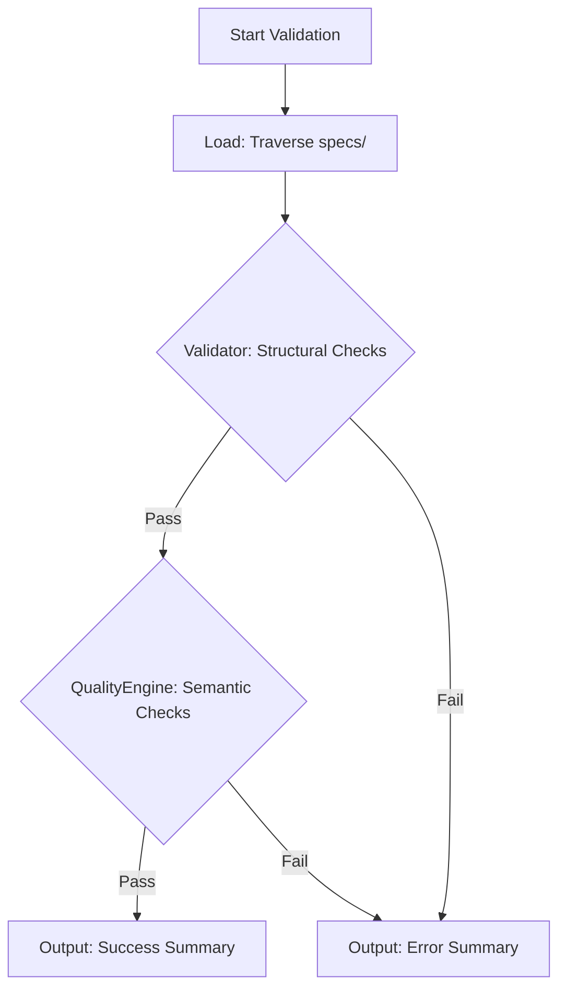

---

## [interface] Validator

**Rationale**: Core entry point for all static architectural checks.

```code
interface Validator {
  validate(specs: ParsedSpec[]): ValidationResult
  detectGaps(specs: Spec[], tests: TestResult, src: SourceCode): GapReport
}
```

---

## [interface] QualityEngine

**Rationale**: Consolidates mechanical, semantic, and terminology rules into a single execution unit to reduce interface fragmentation.

```code
interface QualityEngine {
  checkQuality(spec: Spec): QualityResult
  execute(rules: Rule[], specs: Spec[]): Violation[]
}

---

## [algorithm] CoverageValidation

**Rationale**: Enforces Lawson's Law — every requirement must have a downstream or represent a leaf action.

```pseudocode
function validate_coverage(specs: Spec[]) -> Violation[]:
  violations = []
  graph = build_ref_graph(specs)
  
  for item in graph.upstream_items():
    if len(graph.get_downstream(item.id)) == 0:
      violations.append(OrphanViolation(item.id))
  
  return violations
```

---

## [workflow] SpecValidationWorkflow

**Purpose**: Rigorous validation of specification integrity and contract compliance.

**Rationale**: High-confidence gate ensuring specs are "The Law" before implementation.

**Steps**:
1. [Behavior] Load all `specs/` files.
2. `Validator.validate(specs)` → ValidationResult
3. `QualityEngine.checkQuality(specs)` → QualityResult
4. **Output**: Print results summary and any violations.



