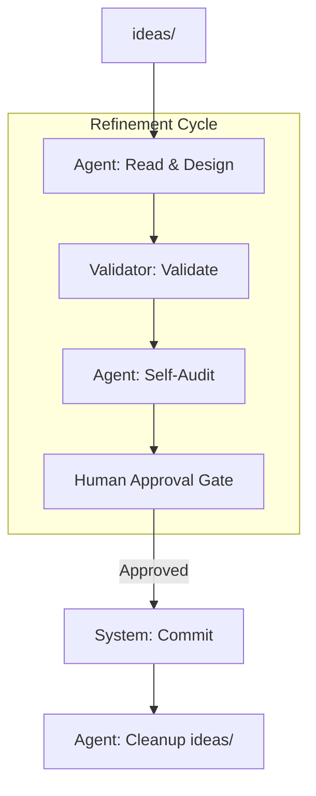

## [decision] LayerClassification

**Rules**:
| Priority | Signal | Layer |
|----------|--------|-------|
| 1 | RFC2119 (MUST/SHOULD/SHALL/MAY) | L1 |
| 2 | Architecture entity (Role/Component) | L2 |
| 3 | Algorithm description | L3 |
| 4 | User expectation | L0 |
| 5 | Default | L0 + clarify |

## [decision] RetryLogic

**Rules**:
| Condition | Action |
|-----------|--------|
| Validation Error | Run auto-fix, then re-validate |
| Compile Error | Stop and report to user |
| Human Reject | Revert change, ask for guidance |
 No | GiveUp |

## [decision] Agent
> Represents the reasoning core of Vibespec.

**Decision Logic**:
1. **Analyze**: Interpret user intent from `ideas/` or conversation context.
2. **Design**: Decompose high-level goals into L0-L3 specification layers.
3. **Refine**: Apply RFC2119 keywords for L1 and type signatures for L3.
4. **Verify**: Perform self-audit against parent layers and standards.
5. **Human Gate**: Present drafts to user and wait for explicit approval.

## [decision] WaitStateHandling

**Rules**:
| Condition | Verdict | Action |
|-----------|---------|--------|
| `status` in `{done, aborted, blocked}` | EXIT | Stop the loop |
| `expected_actor != self` and `status = active` | WAIT | Sleep or back off, then reload shared state |
| `self = fix` and `fix_gate_open = false` | WAIT | Keep waiting; no released repair work exists yet |
| Turn lock unavailable | WAIT | Retry later without ending the loop |
| No-progress window exceeded | ESCALATE | Mark `blocked` or `suspect_stale` and request manual recovery |
| `expected_actor = self` and lock acquired | ACT | Execute the current turn |
| `self = fix` and `fix_gate_open = true` | ACT | Start executing released repair work even if Triage is still classifying later defect classes |

## [decision] AutoDecisionPriority

**Rules**:
| Condition | Verdict | Action |
|-----------|---------|--------|
| Candidate contradicts explicit triage repair logic | REJECT | Do not choose it |
| Candidate expands beyond the released scope boundary | REJECT | Do not choose it |
| Candidate breaks relevant L0-L3 traceability or introduces unrelated behavior | REJECT | Do not choose it |
| Multiple valid candidates remain | PRIORITIZE | Choose the one with the smallest safe behavioral and file delta |
| Tie remains after delta check | PRIORITIZE | Choose the option best supported by latest validation or re-scan evidence |
| No candidate is clearly valid | ESCALATE | Mark ambiguity in `auto-decisions.md` and request human guidance |

## [decision] GateSelection

**Rules**:
| Input | Gate | Action |
|-------|------|--------|
| `vibespec triage gate` | `all-defects` | Triage uses `UnifiedGateTriageWorkflow.DetectAndPlan`, starts from `run-triage-pass`, scans `spec-drift -> src-drift -> quality`, and may release Fix after each classified batch |
| `vibespec fix gate` | `all-defects` | Fix uses `UnifiedGateFixWorkflow.ExecuteRepairPlan`, starts from `run-fix-pass`, keeps repair scope bounded to the released plan, and iterates repair -> validate -> re-scan until the released work is clear |

## [decision] TriageEvidenceRequirements

**Rules**:
| Condition | Verdict | Action |
|-----------|---------|--------|
| Probe packet only defines review scope, comparison anchors, or baseline outputs | REQUIRE | Continue with semantic review; do not treat the packet as a defect finding |
| Triage has not fully read the listed `specs/`, all listed readable `src/` text files, and listed context files | REJECT | Do not publish any defect yet |
| Active class is `spec-drift` and the ordered parent-layer item review is incomplete | REJECT | Do not publish or accept spec-drift yet |
| Active class is `src-drift` and the ordered module/component review against `L2` and `L3` is incomplete | REJECT | Do not publish or accept src-drift yet |
| Active class is `quality` and the semantic review against quality categories plus `L2`/`L3` is incomplete | REJECT | Do not publish or accept quality defects yet |
| Review relies on keyword, regex, naming, or changed-file scanning as defect evidence | REJECT | Do not publish any defect yet |
| Semantic review artifact is missing or does not cover the required targets/anchors for the active class | REJECT | Do not publish any class report yet |
| No semantic contradiction or real quality problem is confirmed | REJECT | Do not publish a defect from the probe result alone |
| Triage publishes any class report | REQUIRE | Persist non-empty `checks_run` and `evidence_summary` |
| Triage rejects defects | REQUIRE | Persist per-defect evidence plus explicit `repair_logic` |
| Triage accepts a class | ALLOW | Keep `defects = []`, but still write audit evidence |

## [decision] SpecDriftSemanticReviewAxes

**Rules**:
| Condition | Verdict | Action |
|-----------|---------|--------|
| Reviewing `spec-drift` | REQUIRE | Compare `L1<-L0`, then `L2<-L1`, then each `L3<-L2` file pair in order |
| Reviewing a layer pair | REQUIRE | Check every reviewed-layer item against the parent-layer item or boundary it consumes |
| Traceability target address style is inconsistent with actual parent-layer items | FLAG | Treat the mismatch as candidate spec drift and decide explicitly |
| Lower layer introduces governance-only or implementation-only detail forbidden by a higher layer | FLAG | Treat the leakage as candidate spec drift and decide explicitly |
| Runner lists unresolved spec context refs | FLAG | Review them as candidate spec drift instead of ignoring them |

## [decision] SrcDriftSemanticReviewAxes

**Rules**:
| Condition | Verdict | Action |
|-----------|---------|--------|
| Reviewing `src-drift` | REQUIRE | Compare relevant src modules against `L2` architecture before accepting semantic alignment |
| Reviewing a src module | REQUIRE | Compare its owned responsibilities against the matching `L2` component or boundary |
| Reviewing a src component | REQUIRE | Check it against the key `L3` workflow/interface/mechanism files that define current behavior |
| Changed files or repository inventory are the only signal | REJECT | Do not publish src drift from delta evidence alone |
| Module/component review reveals broadened ownership, collapsed boundaries, or missing mechanisms | FLAG | Treat the mismatch as candidate src drift and decide explicitly |

## [decision] QualitySemanticReviewAxes

**Rules**:
| Condition | Verdict | Action |
|-----------|---------|--------|
| Reviewing `quality` | REQUIRE | Compare relevant source modules/components against quality target categories plus `L2` architecture and key `L3` mechanisms |
| Proposed evidence is only a keyword, regex, naming, or comment hit | REJECT | Do not publish a quality defect from lexical evidence alone |
| Source review reveals workaround, legacy, concurrency, or waiting defects in behavior/design | FLAG | Treat the mismatch as candidate quality drift and decide explicitly |

## [decision] SubmissionArtifactRequirements

**Rules**:
| Condition | Verdict | Action |
|-----------|---------|--------|
| `repair_rounds = 1` and no artifact dir given | ALLOW | Submission may proceed without repair artifacts |
| `repair_rounds > 1` and no artifact dir given | REJECT | Block submission |
| Artifact dir is outside `specs/build/` | REJECT | Block submission |
| `todo.md` missing | REJECT | Block submission |
| `auto-decisions.md` missing | REJECT | Block submission |
| `auto-decisions.md` misses any labeled decision field | REJECT | Block submission |
---

## [workflow] IdeaToSpecWorkflow

**Purpose**: Ingest raw ideas and refine them into formal specifications.

**Rationale**: Core pipeline for transforming user intent into verifiable system laws.

**Steps**:
1. [Role] `Agent.read("ideas/")` → Extract Raw Intent
2. [Loop: Layer Refinement]
    - [Role] `Agent.design(Intent)` → DraftSpecs
    - `Validator.validate(DraftSpecs)`
    - [Role] `Agent.audit(DraftSpecs)` → AuditLog
    - **Human Approval**: `notify_user(AuditLog)`
3. `System.commit()` → Apply changes to `specs/`
4. [Role] `Agent.cleanup("ideas/")` → Move processed files to archive

```mermaid
graph TD
    I[ideas/] --> A["Agent: Read & Design"]
    subgraph Refinement Cycle
    A --> V[Validator: Validate]
    V --> AU[Agent: Self-Audit]
    AU --> H[Human Approval Gate]
    end
    H -- Approved --> C[System: Commit]
    C --> AC[Agent: Cleanup ideas/]
```

---

## [workflow] DistillWorkflow

**Purpose**: Extract missing specs or unreasonable design from code and propose spec improvements for review.

**Rationale**: Uses code as a discovery surface for spec omissions or bad assumptions, while keeping final spec changes under human approval.

**Steps**:
1. [Role] `Agent.parse("src/")` → Identify code evidence for missing specs or unreasonable design.
2. [Role] `Agent.document()` → Proposed DraftSpecs with explicit evidence and rationale.
3. `Validator.validate(DraftSpecs)`
4. **Human Approval**: `notify_user(DraftSpecs)`
5. `System.patch("specs/")` → Apply approved spec improvements

---

## [workflow] ReflectWorkflow

**Purpose**: Extract formal requirements from current conversation.

**Rationale**: Continuous requirement capture without context loss.

**Steps**:
1. [Role] `Agent.reflect()` → Identify implicit requests
2. [Role] `Agent.propose()` → ProposedIdeas
3. **Human Approval**: `notify_user(ProposedIdeas)`
4. `System.writeIdea(ProposedIdeas)` → Save to `ideas/`

---

## [workflow] BugRCAWorkflow

**Purpose**: Systematic resolution of system failures by tracing to the architectural root cause.

**Rationale**: Ensures that fixes are applied at the highest necessary level of authority (Specs) before implementation.

**Steps**:
1. **Trace (Bottom-Up)**:
    - [Behavior] Trace failure: `Code` -> `L3 Implementation` -> `L2 Component` -> `L1 Contract` -> `L0 Vision`.
    - [Action] Identify the **Root Cause Spec (RCS)**.
2. **Resolve (Top-Down)**:
    - [Role] `Agent.proposeFix(RCS)` → FixProposal.
    - **Human Approval**: `notify_user(FixProposal)`.
    - [Role] `Agent.cascade(FixProposal)` → Cascading updates to Downstream Layers.
3. **Certify**:
    - Enter `CertificationWorkflow` to verify the fix via L1 contract regression.
---

## [workflow] AuditWorkflow

**Purpose**: In-depth inspection of a specific specification item for quality and consistency.

**Rationale**: Provides a formal process for ad-hoc reviews requested via `vibespec review`.

**Steps**:
1. [Behavior] Load Target `SpecID`.
2. [Role] `Agent.verify(SpecID)` using **REVIEW_PROTOCOL**:
    - Hierarchy check (Parent-Child alignment).
    - Focus check (Layer appropriate content).
    - Standard check (PascalCase, RFC2119).
3. **Output**: Print detailed AuditReport with PASS/FAIL status and improvement suggestions.
