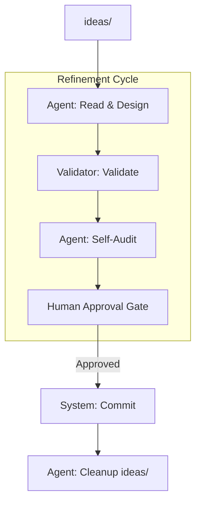

## [decision] LayerClassification

**Rules**:
| Priority | Signal | Layer |
|----------|--------|-------|
| 1 | RFC2119 (MUST/SHOULD/SHALL/MAY) | L1 |
| 2 | Architecture entity (Role/Component) | L2 |
| 3 | Algorithm description | L3 |
| 4 | User expectation | L0 |
| 5 | Default | L0 + clarify |

## [decision] RetryLogic

**Rules**:
| Condition | Action |
|-----------|--------|
| Validation Error | Run auto-fix, then re-validate |
| Compile Error | Stop and report to user |
| Human Reject | Revert change, ask for guidance |
 No | GiveUp |

## [decision] Agent
> Represents the reasoning core of Vibespec.

**Decision Logic**:
1. **Analyze**: Interpret user intent from `ideas/` or conversation context.
2. **Design**: Decompose high-level goals into L0-L3 specification layers.
3. **Refine**: Apply RFC2119 keywords for L1 and type signatures for L3.
4. **Verify**: Perform self-audit against parent layers and standards.
5. **Human Gate**: Present drafts to user and wait for explicit approval.
---

## [workflow] IdeaToSpecWorkflow

**Purpose**: Ingest raw ideas and refine them into formal specifications.

**Rationale**: Core pipeline for transforming user intent into verifiable system laws.

**Steps**:
1. [Role] `Agent.read("ideas/")` → Extract Raw Intent
2. [Loop: Layer Refinement]
    - [Role] `Agent.design(Intent)` → DraftSpecs
    - `Validator.validate(DraftSpecs)`
    - [Role] `Agent.audit(DraftSpecs)` → AuditLog
    - **Human Approval**: `notify_user(AuditLog)`
3. `System.commit()` → Apply changes to `specs/`
4. [Role] `Agent.cleanup("ideas/")` → Move processed files to archive

---

## [workflow] DistillWorkflow

**Purpose**: Sync specifications when code-first changes occur.

**Rationale**: Ensures the "Law" (Specs) eventually reflects the "Truth" (Code).

**Steps**:
1. [Role] `Agent.parse("src/")` → Identify structural changes
2. [Role] `Agent.document()` → Proposed DraftSpecs
3. `Validator.validate(DraftSpecs)`
4. `System.patch("specs/")` → Update L3-RUNTIME items

---

## [workflow] ReflectWorkflow

**Purpose**: Extract formal requirements from current conversation.

**Rationale**: Continuous requirement capture without context loss.

**Steps**:
1. [Role] `Agent.reflect()` → Identify implicit requests
2. [Role] `Agent.propose()` → ProposedIdeas
3. **Human Approval**: `notify_user(ProposedIdeas)`
4. `System.writeIdea(ProposedIdeas)` → Save to `ideas/`

---

## [workflow] BugRCAWorkflow

**Purpose**: Systematic resolution of system failures by tracing to the architectural root cause.

**Rationale**: Ensures that fixes are applied at the highest necessary level of authority (Specs) before implementation.

**Steps**:
1. **Trace (Bottom-Up)**:
    - [Behavior] Trace failure: `Code` -> `L3 Implementation` -> `L2 Component` -> `L1 Contract` -> `L0 Vision`.
    - [Action] Identify the **Root Cause Spec (RCS)**.
2. **Resolve (Top-Down)**:
    - [Role] `Agent.proposeFix(RCS)` → FixProposal.
    - **Human Approval**: `notify_user(FixProposal)`.
    - [Role] `Agent.cascade(FixProposal)` → Cascading updates to Downstream Layers.
3. **Certify**:
    - Enter `CertificationWorkflow` to verify the fix via L1 contract regression.
---

## [workflow] AuditWorkflow

**Purpose**: In-depth inspection of a specific specification item for quality and consistency.

**Rationale**: Provides a formal process for ad-hoc reviews requested via `vibespec review`.

**Steps**:
1. [Behavior] Load Target `SpecID`.
2. [Role] `Agent.verify(SpecID)` using **REVIEW_PROTOCOL**:
    - Hierarchy check (Parent-Child alignment).
    - Focus check (Layer appropriate content).
    - Standard check (PascalCase, RFC2119).
3. **Output**: Print detailed AuditReport with PASS/FAIL status and improvement suggestions.
