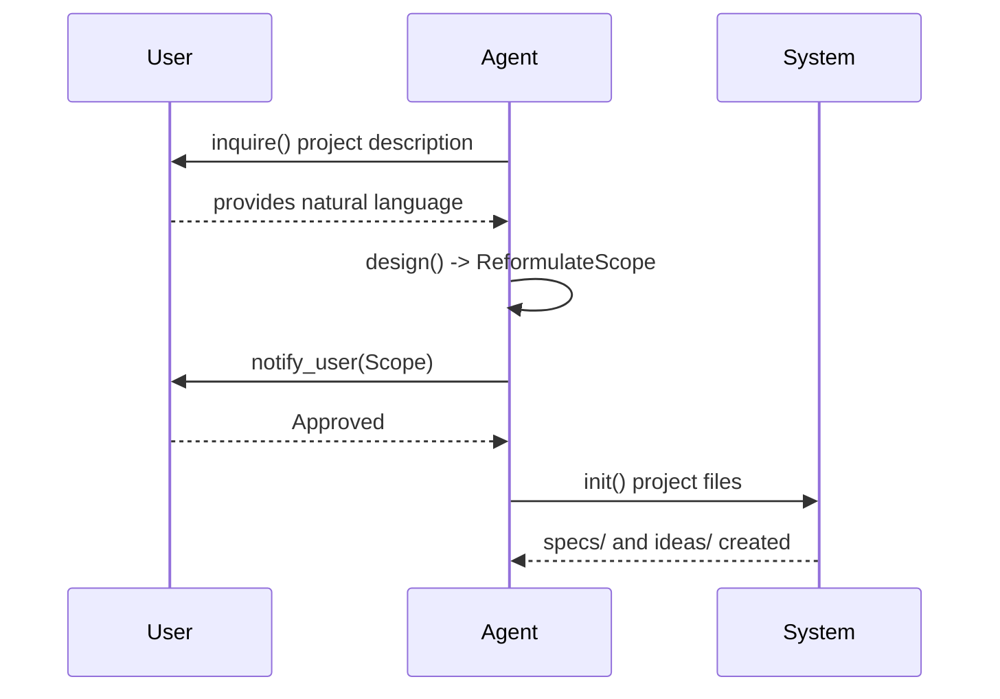

## [interface] System

**Rationale**: The central command router that orchestrates high-level project-wide actions and initializations.

```code
interface System {
  route(input: string): Command
  dispatch(command: Command): Workflow
}
```

## [interface] CoordinationStore

**Rationale**: Provide a shared coordination surface for multi-agent Fix/Triage loops without long-held locks or mandatory heartbeats.

```code
interface CoordinationStore {
  readState(gate: GateKind, focusId?: string): CoordinationState
  runTriagePass(gate: GateKind, focusId?: string): TriageProbePacket
  runFixPass(gate: GateKind, focusId?: string): FixRepairPacket
  tryClaimTurn(gate: GateKind, actor: "fix" | "triage", turnId: int, focusId?: string): ClaimResult
  publishSubmission(gate: GateKind, manifest: SubmissionManifest, focusId?: string): CoordinationState
  publishTriage(gate: GateKind, report: TriageReport, focusId?: string): CoordinationState
  markBlocked(gate: GateKind, reason: string, focusId?: string): CoordinationState
}
```


---

## [workflow] TurnCoordinationWorkflow

**Purpose**: Coordinate two agent sessions so `triage` classifies and releases work while `fix` executes released repairs until Triage reports no defects.

**Rationale**: Enforce staged triage, frozen triage targets, and non-terminal waiting in one unified defect gate under a coordinator-plus-worker baton model without heartbeat overhead.

**Steps**:
1. Agent resolves the unified gate from `vibespec triage gate` or `vibespec fix gate`.
2. Agent loads the installed `subagent-baton` skill as the generic coordination authority and the local coordination reference as a vibespec-specific adapter.
3. Triage automatically resolves `VISION.QUALITY_DETECTION`, preferring the project-defined item when present and otherwise falling back to the vibespec template default, plus built-in spec-drift and src/spec-drift checks.
4. `CoordinationStore.readState()` exposes triage and fix workflow metadata plus baton metadata for the active gate.
5. Triage/Fix sessions load `references/gate_workflows.md` and select the mapped phase prompt from coordination state.
6. The gate starts at `triage_turn` with `active_owner = triage`, `worker_state = dormant`, and the Fix gate closed until Triage releases work.
7. `CoordinationStore.tryClaimTurn()` grants a short lock only for turn validation and artifact publication.
8. `TriageSession` begins from `CoordinationStore.runTriagePass()`, which automatically resets a completed gate into a fresh `triage_turn` cycle and then returns the next class-specific deterministic probe packet for `spec-drift -> src-drift -> quality`.
9. `TriageSession` audits the latest baseline or frozen submission, then `CoordinationStore.publishTriage()` persists `checks_run`, `evidence_summary`, notes, and any released repair items.
10. After each classified batch, `CoordinationStore.publishTriage()` may open the Fix gate immediately while Triage remains the shared-state owner.
11. `FixSession` waits while `worker_state = dormant`; once released, it begins from `CoordinationStore.runFixPass()` and executes bounded repair work against the released scope even while Triage continues scanning later classes.
12. When released work requires repeated repair rounds, `FixSession` creates fresh `specs/build/<timestamp>/todo.md` and `auto-decisions.md` artifacts, derives repair tasks from the released scope, grounds auto-decisions in triage logic plus validation evidence, and iterates repair -> validate -> re-scan until no actionable item remains.
13. After the final class is classified, `CoordinationStore.publishTriage()` either sets `status = done` or hands off final baton ownership with `phase = fix_turn` and `active_owner = fix`.
14. `FixSession` validates the fully repaired state and `CoordinationStore.publishSubmission()` writes `submission_id`, changed files, validation results, repair responses, and multi-round artifact references, then resets the Fix gate and returns baton ownership to `triage_turn`.
15. Waiting sessions reload shared state until they observe a non-wait condition; they do not terminate while `status = active`.
16. If the no-progress window is exceeded, `CoordinationStore.markBlocked()` records manual recovery instead of automatic takeover.

---

## [workflow] BootstrapWorkflow

**Purpose**: Initialize a project when `specs/` is missing.

**Rationale**: Ensure a clean, formal start for every project.

**Steps**:
1. [Role] `Agent.inquire()` → ProjectDescription
2. [Role] `Agent.design(ProjectDescription)` → **ReformulateScope** (SHALL/SHALL NOT)
3. **Human Approval**: `notify_user(ReformulatedScope)`
4. `System.init()` → `specs/L0-VISION.md`, `ideas/`
5. `Validator.validate()` → ReadinessReport


