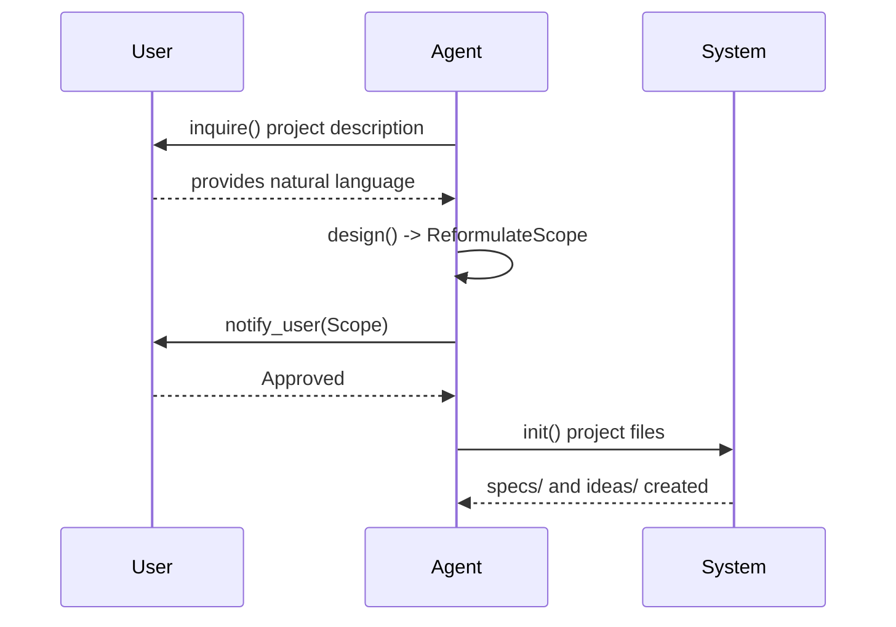

## [interface] System

**Rationale**: The central command router that orchestrates high-level project-wide actions and initializations.

```code
interface System {
  route(input: string): Command
  dispatch(command: Command): Workflow
}
```

## [interface] CoordinationStore

**Rationale**: Provide a shared coordination surface for multi-agent Dev/Review loops without long-held locks or mandatory heartbeats.

```code
interface CoordinationStore {
  readState(gate: GateKind, focusId?: string): CoordinationState
  tryClaimTurn(gate: GateKind, actor: "dev" | "review", turnId: int, focusId?: string): ClaimResult
  publishSubmission(gate: GateKind, manifest: SubmissionManifest, focusId?: string): CoordinationState
  publishReview(gate: GateKind, report: ReviewReport, focusId?: string): CoordinationState
  markBlocked(gate: GateKind, reason: string, focusId?: string): CoordinationState
}
```


---

## [workflow] TurnCoordinationWorkflow

**Purpose**: Coordinate two agent sessions so `dev` and `review` alternate until Review reports no defects.

**Rationale**: Enforce strict turn-taking, frozen review targets, and non-terminal waiting across `defect`, `spec-drift`, and `src-drift` gates without heartbeat overhead.

**Steps**:
1. Agent resolves `gate` from `vibespec dev|review gate defect|spec-drift|src-drift`.
2. For `defect`, Agent loads the project's dedicated quality detection item; for `spec-drift` and `src-drift`, Agent uses built-in script workflows.
3. `DevSession` reads shared coordination state and confirms `status = active` and `expected_actor = dev`.
4. `CoordinationStore.tryClaimTurn()` grants a short lock only for turn validation and artifact publication.
5. `DevSession` resolves open defects, edits `src/` or `specs/`, and runs validation without holding the lock.
6. `CoordinationStore.publishSubmission()` writes `submission_id`, changed files, validation results, and defect dispositions, then sets `phase = review_turn`.
7. `ReviewSession` reads shared coordination state and loads the latest frozen `submission_id`.
8. `ReviewSession` audits only the frozen submission manifest and associated diff using the active gate checklist.
9. If defects remain, `CoordinationStore.publishReview()` writes defect IDs and sets `phase = dev_turn`; otherwise it sets `status = done`.
10. Waiting sessions reload shared state until they observe a non-wait condition; they do not terminate while `status = active`.
11. If the no-progress window is exceeded, `CoordinationStore.markBlocked()` records manual recovery instead of automatic takeover.

---

## [workflow] BootstrapWorkflow

**Purpose**: Initialize a project when `specs/` is missing.

**Rationale**: Ensure a clean, formal start for every project.

**Steps**:
1. [Role] `Agent.inquire()` → ProjectDescription
2. [Role] `Agent.design(ProjectDescription)` → **ReformulateScope** (SHALL/SHALL NOT)
3. **Human Approval**: `notify_user(ReformulatedScope)`
4. `System.init()` → `specs/L0-VISION.md`, `ideas/`
5. `Validator.validate()` → ReadinessReport


