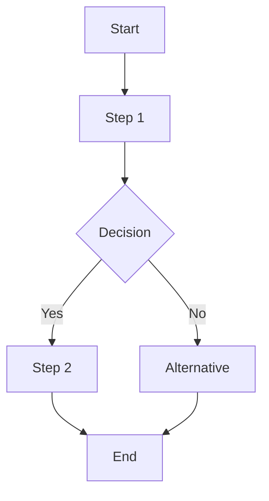

# L3: {{PROJECT_NAME}} Runtime

> This document defines implementation details for L2 components.
> Each item must have a type: `[interface]`, `[decision]`, `[algorithm]`, or `[workflow]`

**Item Type Definitions**

L3 items must be tagged with one of these types:

| Type | Owner | Description | Format |
|------|-------|-------------|--------|
| `interface` | Script | API contract with inputs/outputs | Fixtures: Input/Expected/Case |
| `decision` | Agent | Semantic judgment matrix | Fixtures: Situation/Decision/Rationale |
| `algorithm` | Script | Deterministic computation | Fixtures: Input/Expected/Case |
| `workflow` | Script/Agent | Multi-step orchestration | Fixtures: Scenario/Flow/Outcome |

---

## [interface] {{INTERFACE_NAME}}

> Implements: [Component: COMPONENTS.{{PARENT}}]

[Description of what this interface does]

```typescript
interface {{InterfaceName}} {
    input:  { param1: Type, param2: Type }
    output: { result: Type }
    errors: [ "ERROR_CODE_1", "ERROR_CODE_2" ]
}
```

**Fixtures**:
| Input | Expected | Case |
|-------|----------|------|
| [Valid input] | [Success result] | Normal |
| [Invalid input] | [Error code] | Error |
| [Edge case] | [Edge result] | Edge |

(Ref: CONTRACTS.{{RELEVANT_CONTRACT}})

---

## [decision] {{DECISION_NAME}}

> Implements: [Component: COMPONENTS.{{PARENT}}]

Agent decision matrix for [scenario].

**Context**: [When to apply this decision]

**Fixtures**:
| Situation | Decision | Rationale |
|-----------|----------|-----------|
| [Condition A] | [Action 1] | [Reason] |
| [Condition B] | [Action 2] | [Reason] |
| [Edge case] | [Fallback] | [Reason] |

(Ref: CONTRACTS.{{RELEVANT_CONTRACT}})

---

## [algorithm] {{ALGORITHM_NAME}}

> Implements: [Component: COMPONENTS.{{PARENT}}]

[Description of what this algorithm computes]

```pseudocode
algorithm {{AlgorithmName}}:
    INPUT: data: Type
    OUTPUT: result: Type
    
    1. [Step 1]
    2. [Step 2]
    3. Return result
```

**Complexity**: O([complexity])

**Fixtures**:
| Input | Expected | Case |
|-------|----------|------|
| [Normal data] | [Normal result] | Normal |
| [Empty] | [Empty result] | Edge |
| [Invalid] | [Error] | Error |

(Ref: CONTRACTS.{{RELEVANT_CONTRACT}})

---

## [workflow] FULL_WORKFLOW

> Implements: [Component: COMPONENTS.{{PARENT}}]

Complete project workflow orchestrating all components and roles.



**Phases**:
1. **Phase 1**: [Description]
2. **Phase 2**: [Description]
3. **Phase 3**: [Description]

**Role Orchestration**:
| Phase | Role | Component |
|-------|------|-----------|
| [Phase 1] | Agent/Script | [Component] |
| [Phase 2] | Agent/Script | [Component] |

**Fixtures**:
| Scenario | Expected Flow | Outcome |
|----------|---------------|---------|
| Happy path | A→B→C→D→F | Success |
| Alternative | A→B→C→E→F | Alternative result |

(Ref: CONTRACTS.{{RELEVANT_CONTRACT}})
