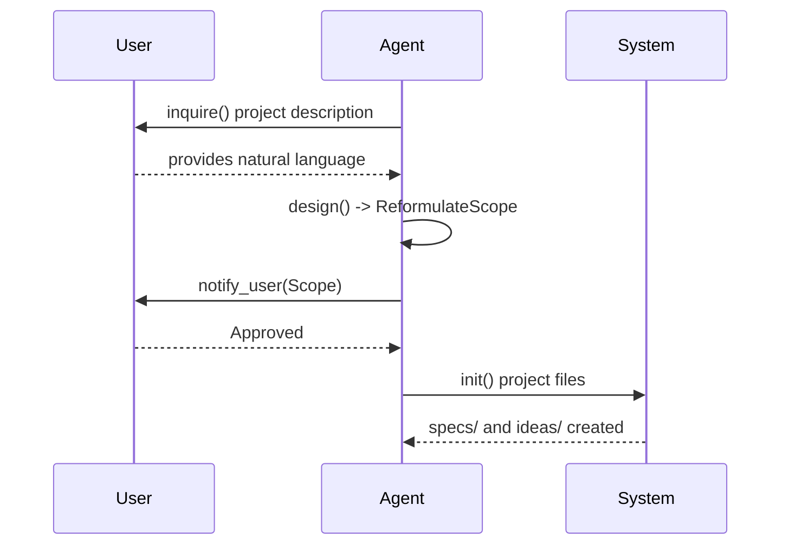

## [interface] System

**Rationale**: The central command router that orchestrates high-level project-wide actions and initializations.

```code
interface System {
  route(input: string): Command
  dispatch(command: Command): Workflow
}
```


---

## [workflow] BootstrapWorkflow

**Purpose**: Initialize a project when `specs/` is missing.

**Rationale**: Ensure a clean, formal start for every project.

**Steps**:
1. [Role] `Agent.inquire()` → ProjectDescription
2. [Role] `Agent.design(ProjectDescription)` → **ReformulateScope** (SHALL/SHALL NOT)
3. **Human Approval**: `notify_user(ReformulatedScope)`
4. `System.init()` → `specs/L0-VISION.md`, `ideas/`
5. `Validator.validate()` → ReadinessReport


