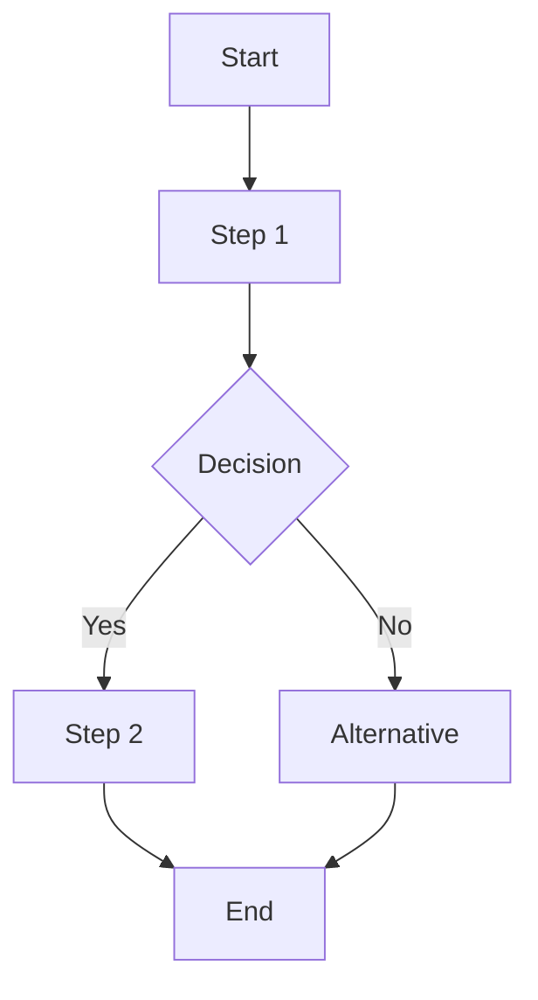

# L3: {{PROJECT_NAME}} Runtime

> This document defines implementation details for L2 components.
> Each item must have a type: `[interface]`, `[decision]`, `[algorithm]`, or `[workflow]`

**Item Type Definitions**

L3 items must be tagged with one of these types:

| Type | Owner | Description |
|------|-------|-------------|
| `interface` | System | API contract with inputs/outputs |
| `decision` | Agent | Semantic judgment matrix |
| `algorithm` | System | Deterministic computation |
| `workflow` | System/Agent | Multi-step orchestration |

---

## [interface] {{INTERFACE_NAME}}

[Description of what this interface does]

**Rationale**: [Why this interface is designed this way]

```typescript
interface {{InterfaceName}} {
    input:  { param1: Type, param2: Type }
    output: { result: Type }
    errors: [ "ERROR_CODE_1", "ERROR_CODE_2" ]
}
```

---

## [decision] {{DECISION_NAME}}

Agent decision logic for [scenario].

**Context**: [When to apply this decision]

**Rationale**: [Why this decision follows these rules]

**Rules**:
| Situation | Decision | Rationale |
|-----------|----------|-----------|
| [Condition A] | [Action 1] | [Reason] |
| [Condition B] | [Action 2] | [Reason] |

---

## [algorithm] {{ALGORITHM_NAME}}

[Description of what this algorithm computes]

**Rationale**: [Why this algorithm is used]

```pseudocode
algorithm {{AlgorithmName}}:
    INPUT: data: Type
    OUTPUT: result: Type
    
    1. [Step 1]
    2. [Step 2]
    3. Return result
```

**Complexity**: O([complexity])

---

## [workflow] {{WORKFLOW_NAME}}

Complete project workflow orchestrating components and roles.

**Purpose**: [What this workflow achieves]

**Rationale**: [Why this flow is necessary]

**Steps**:
1. [Role] `{{ROLE_NAME}}.{{ACTION}}` → {{RESULT}}
2. `{{COMPONENT_NAME}}.{{METHOD}}({{RESULT}})`
3. **Human Approval**: `notify_user({{OUTCOME}})`



**Phases**:
1. **Phase 1**: [Description]
2. **Phase 2**: [Description]

**Role Orchestration**:
| Phase | Role | Component |
|-------|------|-----------|
| [Phase 1] | Agent/System | [Component] |
| [Phase 2] | Agent/System | [Component] |
